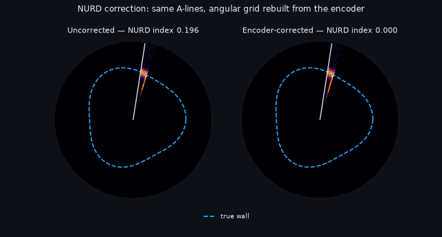
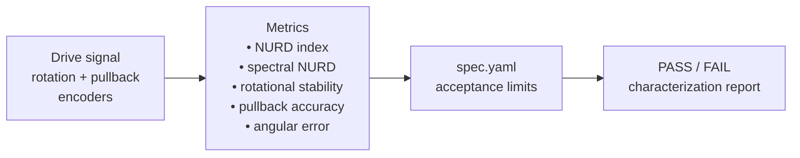
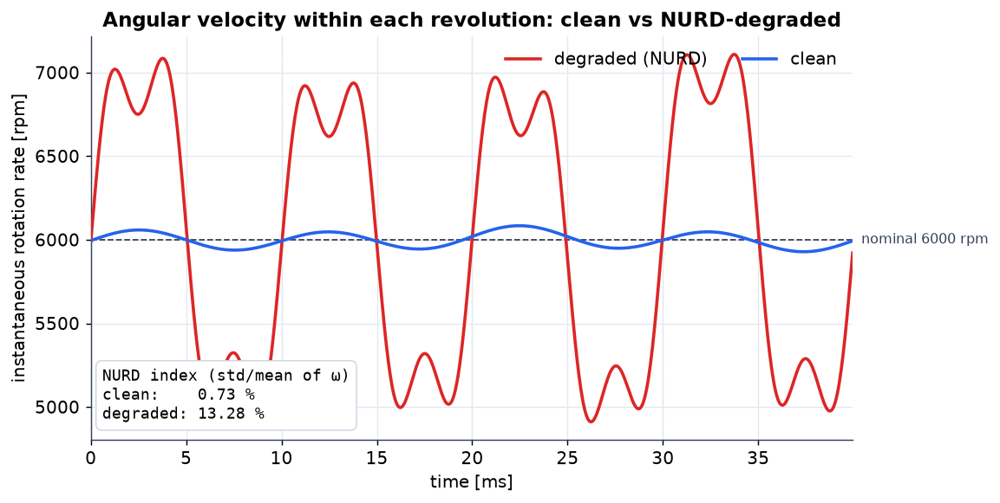
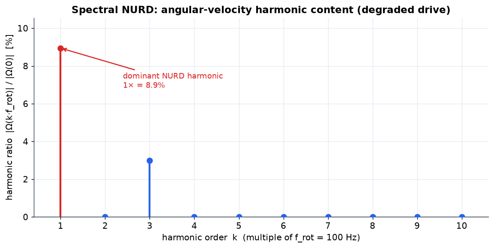
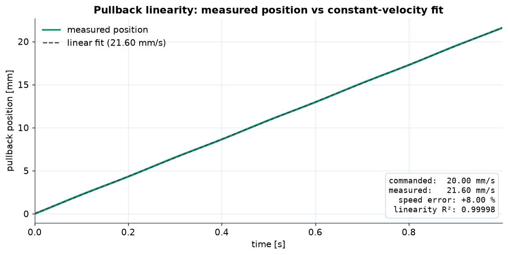
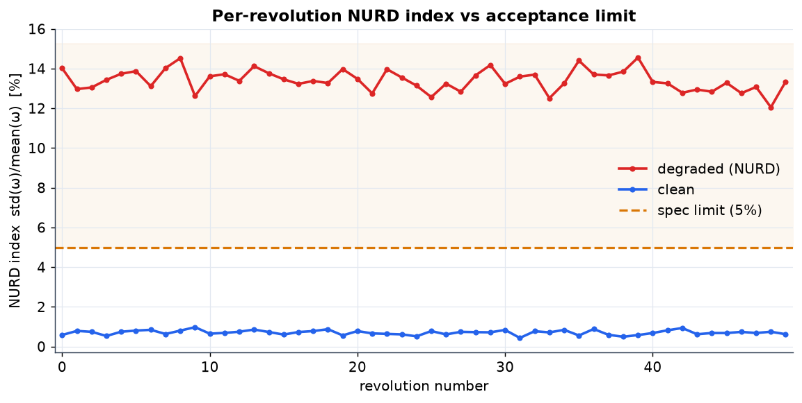
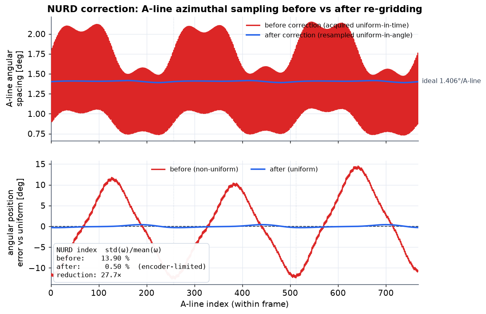

# OCT Catheter Drive Test

[](https://github.com/earosenfeld/oct-catheter-drive-test/actions/workflows/ci.yml)

Bench **characterization toolkit for the drive mechanics of intravascular OCT
(Optical Coherence Tomography) catheters** — rotational stability, **NURD
(Non-Uniform Rotational Distortion)** measurement **and correction**, and
pullback accuracy — with ground-truth-validated metrics and an automated
pass/fail characterization report.

> Engineering verification & validation of *drive mechanics* only. This is a
> simulation / signal-analysis bench and makes **no clinical or diagnostic claims**.



*Same acquired A-lines, two angular grids: the uncorrected panel paints them at
assumed-uniform angles (the vessel wall warps away from the true outline); the
corrected panel rebuilds the grid from the encoder via `correct_nurd()` and the
wall lands back on the phantom. Regenerate with `python scripts/make_demo_gif.py`.*

## Why this exists

An OCT catheter images by spinning a fiber-optic core (typically ~100 rev/s) at
the distal tip while pulling it back along the vessel. Image quality is governed
by how *uniformly* that core rotates and how *accurately* it is pulled back:

- **NURD** — torque-cable friction/binding makes the distal optics speed up and
  slow down within a single revolution, smearing features azimuthally. It is the
  #1 image-quality killer and the headline metric here.
- **Rotational jitter / wow & flutter** — revolution-to-revolution speed instability.
- **Pullback accuracy & uniformity** — sets the longitudinal (pullback-axis) image scale.

## How it works

A synthetic (or measured) drive signal — the rotation and pullback encoder
channels — flows through the metric analyzers, each result is compared against
`spec.yaml`, and a PASS/FAIL characterization report is stamped.



## Metrics implemented

| Metric | Definition |
|---|---|
| NURD index | `std(ω) / mean(ω)` over a revolution (dimensionless, ×100 → %) |
| Spectral NURD | Hann-windowed FFT of `ω(t)`; harmonic content at `k·f_rot` relative to DC, with the dominant harmonic |
| Per-rotation NURD map | NURD index for each completed revolution |
| Rotational stability | period-to-period std & peak-to-peak; wow (slow) vs flutter (fast) split; RPM mean/std |
| Pullback accuracy | measured vs commanded mm/s, % error, speed CV, max deviation, position-vs-time linearity R² |
| Angular position error | cumulative commanded-vs-measured θ per revolution |

A **synthetic drive-signal generator** injects *known* NURD harmonics, jitter and
pullback error, so every metric is validated against ground truth in the test
suite (inject a known distortion → assert the analyzer recovers it).

## Visualizations

Generated from the real API by `scripts/make_figures.py` (fixed seeds, headless),
contrasting a clean in-spec drive against a degraded one (binding torque cable:
strong 1× + 3× NURD, jitter, 8% pullback overspeed). Engineering characterization
of drive mechanics only — no clinical or diagnostic interpretation.



*Instantaneous rotation rate across four revolutions. The clean drive (blue)
holds ~6000 rpm; the degraded drive (red) speeds up and slows down within each
revolution — this within-rev modulation is NURD. The NURD index `std(ω)/mean(ω)`
rises from 0.7% to 13.3%.*



*Harmonic content of `ω(t)` at multiples of the rotation frequency (`f_rot` =
100 Hz), normalized to DC. The dominant once-per-revolution (1×) component
flags the bind; the recovered ratios match the injected harmonic amplitudes
(`H_k ≈ a_k/2`).*



*Pullback position vs time with a constant-velocity fit overlaid. The measured
speed (21.6 mm/s) exceeds the commanded 20.0 mm/s by +8.0% — a calibration bias
— while linearity stays high (R² = 0.99998).*



*NURD index computed for each completed revolution, against the `spec.yaml`
acceptance limit (5%). The clean drive stays near 0.7%; the degraded drive sits
~13% across every revolution, in the fail zone.*

## NURD correction

Measuring NURD is only half the job — the toolkit can also **correct** it. NURD
arises because A-lines are acquired uniformly in *time* while the fiber core, due
to torque-cable friction, rotates non-uniformly in *angle*; consecutive A-lines
are therefore separated by a varying azimuthal angle, smearing the frame. Real
OCT systems fix this by **resampling the A-line stream from its non-uniform
angular spacing back onto a uniform angular grid**, using the measured
instantaneous rotation (rotary encoder, or here the generator ground truth).

`oct_drive_test.correction` implements exactly that re-gridding:

1. Build a uniform angular grid (`n_per_rev` points per revolution, an exact
   integer per 2π so every revolution samples identically).
2. **Invert the measured cumulative angle** `θ(t)` — for each target grid angle,
   interpolate the time at which the core actually passed through it
   (`t = θ⁻¹(angle)`).
3. Resample the per-A-line payload at those corrected times → an equi-angular
   A-line stream.

```python
from oct_drive_test import correction

# measured (NURD-distorted) drive signal from the generator/encoder
corr = correction.correct_drive_signal(sig, n_per_rev=512)
corr.nurd_index_before     # std(ω)/mean(ω) of the raw, uniform-time stream
corr.nurd_index_after      # residual on the corrected uniform-angle grid (~0)
corr.improvement_factor    # before / after
corr.theta_grid, corr.t_grid   # uniform angle grid + corrected A-line times
```

The residual is the **same** `std/mean` NURD index applied to the corrected
stream's angular increments (`residual_nurd`), not a relaxed metric — on a
uniform-angle grid those increments are constant, so the index collapses to the
numerical floor. The validation suite injects a known ~13% NURD, confirms the
index is high, then asserts the residual drops by many orders of magnitude after
correction, while a clean (NURD-free) signal is left essentially untouched (no
distortion is injected).



*A-line azimuthal sampling before vs after angular resampling, for the degraded
(binding-cable) drive. **Top:** the spacing between consecutive A-lines wobbles
0.75°–2.1° when sampled uniformly in time (red), but is pinned to the ideal
1.406°/A-line after re-gridding (blue). **Bottom:** the cumulative angular
position error vs the ideal uniform grid sweeps ±12° before correction and
collapses to ~0 after. The NURD index falls from 13.9% to the numerical floor.
Engineering characterization of drive-correction signal processing only — no
clinical or diagnostic interpretation.*

## Install

```bash
pip install -e ".[dev]"      # numpy, scipy, pyyaml (+ pytest, matplotlib)
```

## Quickstart

```bash
# Two-scenario example: a clean in-spec drive (PASS) + a degraded drive (FAIL).
python examples/run_characterization.py

# Characterize a synthetic signal against a spec and stamp PASS/FAIL:
oct-drive-report --spec spec.yaml
```

```python
from oct_drive_test import nurd
from oct_drive_test.generator import generate_drive_signal, NurdHarmonic

sig = generate_drive_signal(...)         # inject known NURD/jitter/pullback (see example)
summary = nurd.nurd_summary(sig)
print(summary["nurd_index_pct_overall"], summary["dominant_harmonic_k"])
```

## Characterization report & spec

`spec.yaml` declares acceptance limits (nominal RPM and tolerance, max NURD index,
pullback accuracy, jitter ceiling). The report runner measures a dataset and
stamps **PASS/FAIL per limit** — the structure of a real V&V characterization record.

## Package layout

```
oct_drive_test/
├── generator.py   # synthetic drive-signal generator (ground-truth injection)
├── nurd.py        # NURD index + spectral / per-rotation NURD
├── correction.py  # NURD correction: encoder-based angular resampling
├── rotation.py    # rotational stability: jitter, wow/flutter, RPM stats
├── pullback.py    # pullback speed accuracy & uniformity
├── angular.py     # angular position error
├── spec.py        # spec.yaml loading + pass/fail characterization report
├── backlash.py    # torque-cable wind-up / backlash (stretch)
└── aline.py       # A-line trigger-interval timing (stretch)
```

## Testing

```bash
pytest -q          # ground-truth validation of every metric
```

## Sample reports

**Sample reports:** [clean drive](examples/output/report_clean.md) · [degraded drive](examples/output/report_degraded.md) — generated by `oct-drive-report`, no setup needed to read them.

## License

MIT © Eric Rosenfeld — see [LICENSE](LICENSE).
